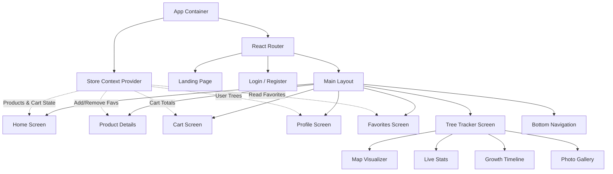

# Documentación Técnica: Nature Wellness Marketplace

## 1. Requerimientos de Negocio (Business Requirements)

Esta sección define el alcance funcional y no funcional del proyecto para asegurar que el producto cumpla con los objetivos comerciales y de experiencia de usuario.

### 1.1 Visión General y Propuesta de Valor
*   **Concepto**: Un marketplace híbrido que combina e-commerce (productos orgánicos), turismo de bienestar (retiros) y acción climática (adopción de árboles).
*   **Identidad de Marca**: "Eco-Luxury". La interfaz debe ser oscura, sofisticada, utilizando desenfoques (glassmorphism), tipografías sans-serif modernas y una paleta de colores inspirada en el bosque nocturno.
*   **KPIs Principales**:
    *   Tasa de Conversión (Visitante -> Comprador/Adoptante).
    *   Retención (Usuarios que regresan a ver crecer su árbol).
    *   Impacto Ecológico (Total de CO2 compensado).

### 1.2 Módulos Funcionales Detallados

#### A. Autenticación y Gamificación (Login/Register)
*   **Crecimiento Visual**: El input de contraseña actúa como un disparador de animación.
    *   *Regla*: 1-3 caracteres = Semilla; 4-7 = Brote; 8+ = Árbol joven.
*   **Social Login**: Integración simulada con Google para reducir fricción.
*   **Perfil de Usuario**: Sistema de niveles basado en "Green Points" (Earth Guardian, Seed Planter, Forest Master).

#### B. Catálogo y Descubrimiento (Home & Search)
*   **Búsqueda Inteligente**: Filtrado por categoría (Retiros, Árboles, Productos).
*   **Chips de Navegación Rápida**: Acceso directo a sub-categorías sin recargar página.
*   **Featured & New Arrivals**: Algoritmo de visualización (simulado) para promocionar ítems de alto margen o impacto.

#### C. Lista de Deseos (Favoritos)
*   **Persistencia de Sesión**: Los favoritos deben mantenerse mientras el usuario navegue por la app (usando React Context).
*   **Interacción Inmediata**: Feedback háptico o visual instantáneo al dar "Like".
*   **Call-to-Action en Vacío**: Si la lista está vacía, mostrar un botón prominente que redirija al catálogo.

#### D. Tree Tracker (Seguimiento de Impacto)
*   **Dashboard Inmersivo**: No es solo una lista, es una experiencia visual.
*   **Mapa Interactivo**: Tarjeta estilo satélite con coordenadas GPS fijas.
*   **Línea de Tiempo de Vida**: Registro histórico inmutable.
    *   *Eventos*: Plantado, Germinado, Primera Foto, Auditoría de Carbono, Mantenimiento Anual.
*   **Certificados**: Opción de descarga de PDF (simulada) para compartir en redes sociales.

### 1.3 Requerimientos No Funcionales
*   **Performance**: First Contentful Paint (FCP) < 1.5s. Uso eficiente de imágenes (WebP/lazy loading).
*   **Accesibilidad**: Cumplimiento WCAG 2.1 nivel AA. Contraste suficiente en modo oscuro. Etiquetas ARIA en botones de íconos.
*   **Responsividad**: Diseño "Mobile-First" adaptable a Tablet y Desktop.
*   **Stack Tecnológico**: React 19, TypeScript, Tailwind CSS, React Router v7.

---

## 2. Flujo del Usuario (User Journeys)

Detalle paso a paso de las interacciones críticas.

### 2.1 Flujo de Adopción (The Hero Journey)
1.  **Descubrimiento**: Usuario aterriza en `LandingPage`. Scroll hasta ver la animación del árbol. Se emociona con la propuesta.
2.  **Registro**: Clic en "Start Journey". Va a `LoginScreen`. Escribe contraseña viendo crecer su árbol digital. Login exitoso.
3.  **Exploración**: Aterriza en `HomeScreen`. Ve "Adopt a Redwood" en "Featured".
4.  **Decisión**: Clic en la tarjeta. Va a `DetailsScreen`. Lee sobre la ubicación y CO2.
5.  **Acción**: Clic en "Book Now" (simulado como añadir al carrito). Va a `CartScreen`.
6.  **Checkout**: Revisa resumen. Clic en "Pay". Transacción exitosa.
7.  **Recompensa**: El árbol aparece en su `ProfileScreen` bajo "My Forest".

### 2.2 Flujo de Monitoreo (Retention Loop)
1.  **Entrada**: Usuario recibe notificación (simulada) o decide entrar a ver su árbol.
2.  **Navegación**: Va a `ProfileScreen`.
3.  **Selección**: Clic en el botón "Track" del árbol "Giant Sequoia #402".
4.  **Consumo**:
    *   Ve que la edad cambió a "2 Yrs".
    *   Ve una nueva foto en la galería "Field Updates".
    *   Revisa el mapa para ver dónde está exactamente.
5.  **Salida/Compartir**: Clic en "Share" o "Download Certificate".

---

## 3. Modelo de Datos del Usuario (Data Schema)

Estructura de datos completa en TypeScript para soportar la lógica de negocio descrita.

```typescript
/**
 * MODELO CENTRAL DE DATOS
 */

// 1. Usuario y Perfil
interface User {
  id: string;
  email: string;
  displayName: string;
  photoURL?: string;
  role: 'user' | 'admin';
  preferences: UserPreferences;
  gamification: UserGamification;
  wallet: UserWallet;
}

interface UserPreferences {
  theme: 'dark' | 'light' | 'system';
  notifications: {
    email: boolean;
    push: boolean;
    treeUpdates: boolean;
  };
  currency: 'USD' | 'EUR';
}

interface UserGamification {
  level: string; // "Seed", "Sprout", "Sapling", "Earth Guardian"
  currentPoints: number;
  nextLevelThreshold: number;
  badges: Badge[];
}

interface Badge {
  id: string;
  name: string;
  icon: string;
  awardedDate: string; // ISO Date
}

interface UserWallet {
  savedCards: PaymentMethod[];
  billingAddress: Address;
}

// 2. Productos y Catálogo
type ProductCategory = 'Retreat' | 'Tree' | 'PhysicalProduct' | 'DigitalGoods';

interface Product {
  id: number;
  slug: string;
  title: string;
  description: string;
  shortDescription: string;
  price: number;
  currency: string;
  category: ProductCategory;
  images: string[];
  stock: number;
  rating: number;
  reviewsCount: number;
  features: string[]; // Highlights (e.g., "Organic", "Vegan")
  location?: {
    lat: number;
    lng: number;
    name: string;
  };
}

// 3. Sistema de Adopción (Tracker)
interface AdoptedTree {
  id: string;
  userId: string; // FK -> User
  productId: number; // FK -> Product (Origen)
  nickname: string;
  adoptionDate: string; // ISO Date
  certificateUrl: string;
  
  // Datos Vivos
  status: 'Healthy' | 'Maintenance' | 'Critical';
  geolocation: {
    lat: number;
    lng: number;
  };
  metrics: {
    ageDays: number;
    heightCm: number;
    co2OffsetKg: number;
  };
  
  // Historial
  timeline: TimelineEvent[];
  gallery: GalleryImage[];
}

interface TimelineEvent {
  id: string;
  date: string;
  title: string;
  description: string;
  type: 'Milestone' | 'Audit' | 'Update';
  icon: string; // Material Symbol name
}

interface GalleryImage {
  id: string;
  url: string;
  caption: string;
  dateUploaded: string;
}

// 4. E-commerce (Carrito y Órdenes)
interface CartItem {
  productId: number;
  quantity: number;
  selectedOptions?: Record<string, string>; // e.g., { date: "2024-10-15" }
}

interface Order {
  id: string;
  userId: string;
  items: CartItem[];
  totalAmount: number;
  status: 'Pending' | 'Paid' | 'Fulfilled';
  createdAt: string;
}
```

---

## 4. Arquitectura y Diagrama de Clases

La arquitectura sigue un patrón basado en componentes funcionales con Hooks para lógica y Context API para estado global.

### Diagrama de Componentes y Flujo de Datos



### Explicación de la Arquitectura
1.  **Providers (Capa de Datos)**:
    *   `StoreContext`: Gestiona el catálogo de productos (mockeado), el carrito de compras y la lista de favoritos. Evita el prop-drilling.
    *   *(Futuro)* `AuthContext`: Gestionaría el usuario logueado.

2.  **Screens (Capa de Vista)**:
    *   Componentes de alto nivel que corresponden a rutas. Son responsables de obtener datos del Contexto y pasarlos a componentes UI más pequeños.

3.  **UI Components (Capa de Presentación)**:
    *   Botones, Inputs, Cards. Son componentes "tontos" (presentacionales) que reciben props y emiten eventos. Se estilizan con Tailwind.

4.  **Routing Strategy**:
    *   `Layout`: Un componente envoltorio que decide cuándo mostrar la `BottomNav` (solo en vistas principales) y maneja la estructura base (fondo oscuro).
